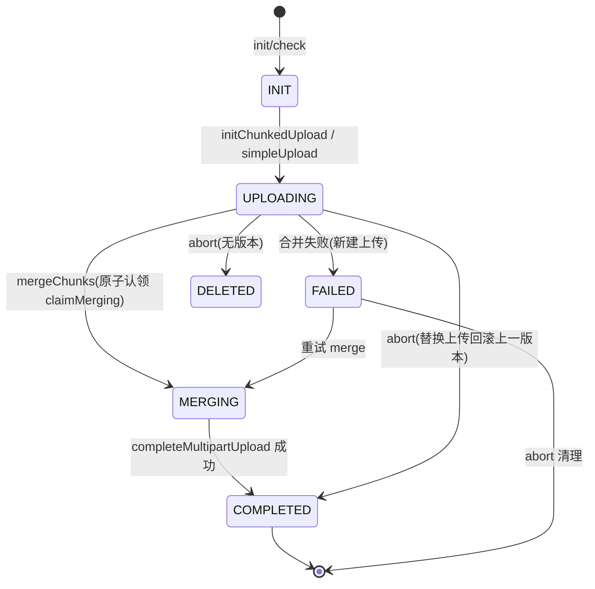
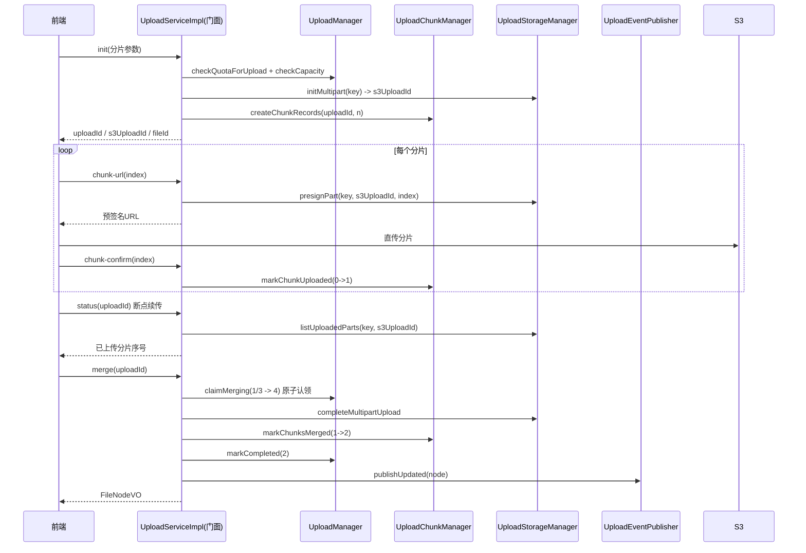

# Change Report：TASK-002 上传流程状态机优化

> 编码完成后的变更汇总。归属 exitCriteria：IMPLEMENTED。产出者：backend-engineer。关联 State：`.ai/state/20260811-codex-tasks-execution.yaml`。

## 背景
上传链路职责集中在一个 542 行 `UploadServiceImpl` 门面，状态仅 0-3（待上传/上传中/已完成/失败），缺少显式合并中/已删除状态；merge 无幂等守卫（重复 merge 会重复合并或报错）；confirm 不落库分片状态；失败后新建上传节点被删除、无法断点续传重试。TASK-002 引入状态机与幂等语义，并拆分职责。

## 状态转换图

## 上传时序图

## 修改文件清单
**新增**
- `st-core/.../service/impl/upload/UploadManager.java` — 状态机转换/配额检查/失败与中止回滚策略
- `st-core/.../service/impl/upload/UploadChunkManager.java` — file_chunk 创建/查询/状态流转/清理
- `st-core/.../service/impl/upload/UploadStorageManager.java` — S3 分片生命周期与对象/容量封装
- `st-core/.../service/impl/upload/UploadEventPublisher.java` — 索引/同步事件统一发布
- `st-core/src/test/.../UploadStateMachineIntegrationTest.java` — 6 个集成用例

**修改**
- `st-core/.../enums/UploadStatus.java` — PENDING→INIT(0)，新增 MERGING(4)/DELETED(5)，`isTerminal()`
- `st-core/.../service/impl/UploadServiceImpl.java` — 降为编排门面，委托 4 个管理器；merge 幂等、confirm 分片落库、abort 守卫
- `st-core/.../mapper/FileNodeMapper.java` — 新增 `claimMerging`（1/3→4 原子认领）
- `st-core/.../mapper/FileChunkMapper.java` — 新增 `markChunkUploaded`（0→1 幂等）
- `docker/mysql/init/02_create_tables.sql` — upload_status 注释补充 4-合并中 5-已删除
- `st-core/src/test/resources/schema.sql` — 补充 file_chunk/file_version/sys_user/sys_tenant/team_space 测试表

## 与 TASK 验收标准对照
| 验收标准 | 实现 | 状态 |
|---|---|---|
| 上传失败可恢复（断点续传列出已传分片） | 新建上传合并失败保留节点与分片标记 FAILED；`status` 走 S3 `listUploadedParts` 列出已传分片；重试 merge 从 FAILED 认领 | ✅ |
| 重复 merge / check 幂等，不产生重复节点 | `claimMerging` 原子认领 + COMPLETED 早退；分片合并后保留(status=2)支撑幂等；测试验证 complete 仅 1 次、节点不重复 | ✅ |
| 分片重试不乱序错数据 | S3 multipart 按 partNumber 归并；confirm 幂等落库(0→1)；分片序号唯一键 `(upload_id, chunk_index)` | ✅ |

## 测试结果
- `mvn test -pl st-core -am`：退出码 0，21 个测试全绿（新增 `UploadStateMachineIntegrationTest` 6 用例 + TASK-001 5 用例 + 既有收藏 10 用例）
- 覆盖场景：初始化建节点/分片、confirm 落库+幂等、merge 成功+幂等（complete 仅一次、无重复节点）、merge 失败保留 FAILED 节点供重试并恢复、abort 清理+幂等、abort 已完成上传 noop
- 全模块 `mvn compile` 通过；`.ai/scripts/verify-loop.ps1` PASS

## 明确未改动项（符合 TASK 禁止范围）
- 前端上传接口契约不变：check/init/status/merge/abort/chunk-url/chunk-confirm 签名与响应结构未改
- 未引入新表（状态用现有 upload_status + file_chunk 表达；仅注释与枚举语义扩展）
- 限速门控（getChunkUrl/confirmChunk）逻辑保持

## 风险
- **S3 与 DB 非原子**：`completeMultipartUpload` 成功后若后续 DB 步骤异常，事务回滚但 S3 已合并；重试可能触发 S3「已完成再合并」报错（pre-existing，非本次引入，建议后续在 complete 前对同 key 幂等）
- **已完成上传分片记录保留**（status=2 支撑幂等），长时间会累积；建议后续定时清理 `status=2 且 updated_at 超期` 的记录（已记录为后续优化）
- **DELETED(5) 状态为保留语义**：当前新建上传 abort 仍物理删除节点（行为不变），DELETED 供未来软删除/审计场景使用
- 版本恢复路径（restoreVersion）未纳入状态机（属于版本功能，不在本 TASK 范围）

## 下一步
- TASK-003 容量并发原子化（配额读后写改原子条件扣减）